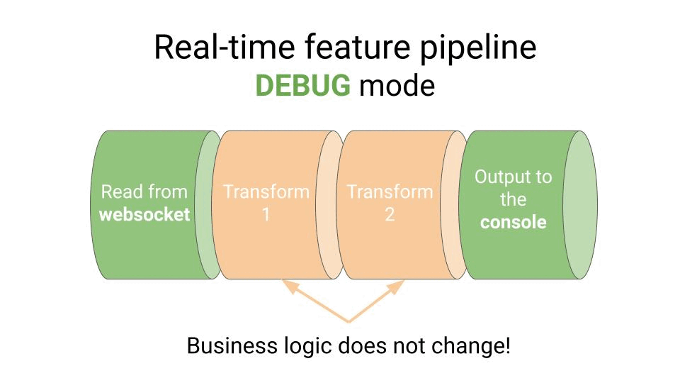
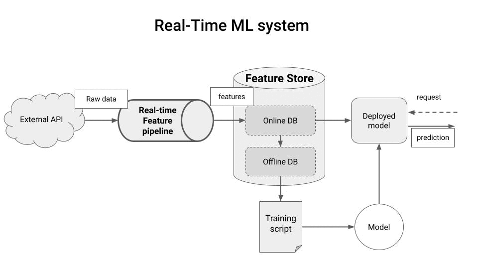
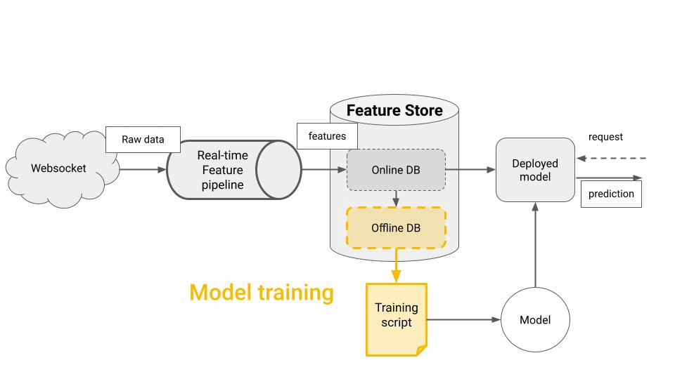

<div align="center">
    <h2>MLOps best practices</h2>
    <h1>How to build a modular real-time feature pipeline in Python</h1>
</div>

<br>

<p align="center">
  
</p>

#### Table of contents
* [What is a real-time feature pipeline?](#what-is-a-real-time-feature-pipeline)
* [The problem](#the-problem)
* [The solution](#the-solution)
* [Python implementation using Bytewax](#python-implementation-using-bytewax)
* [Run the whole thing in 5 minutes](#run-the-whole-thing-in-5-minutes)
* [Wanna learn more real-time ML with me?](#wanna-learn-more-real-time-ml)


## What is a real-time feature pipeline?

A real-time feature pipeline is a program that constantly transforms

* **raw data**, e.g. stock trades from an external web socket, into
* **features**, e.g. OHLC (open-high-low-close) data for stock trading

and saves these features into a Feature Store.

Real-time feature pipelines are used for real-time ML problems like fraud detection, or cutting-edge recommender systems.


<p align="center">
  
</p>

Once the features are in the store, you can fetch them to

* **train an ML model**, from the offline feature store or
* **generate predictions with your deployed model**, from the online feature store.

<p align="center">
  
</p>

## The problem

To ensure your deployed model performance matches the test metrics you get at training time, you need to generate features IN THE EXACT SAME WAY.

This is especially tricky for real-time feature pipelines, where

* live raw data often comes from an external web socket, while
* historical data comes from external offline storage, like a data warehouse.


## The solution

We would like to re-use as much code as possible, and only re-write pre-processing and post-processing logic, depending on

* the input source, either web socket or data warehouse, and
* the output sink, either printing on the console (for debugging), the online feature store (for real-time inference), or the offline feature store (for ML Model training)

<p align="center">
  
</p>


## Python implementation using Bytewax

Python alone is **not** a language designed for speed 🐢, which makes it unsuitable for real-time processing. Because of this, real-time feature pipelines were usually writen with Java-based tools like Apache Spark or Apache Flink.

However, things are changing fast with the emergence of Rust 🦀 and libraries like **[Bytewax 🐝](https://github.com/bytewax/bytewax?utm_source=pau&utm_medium=partner&utm_content=github)** that expose a pure Python API on top of a highly-efficient language like Rust.

So you get the best from both worlds.

- Rust's speed and performance, plus
- Python-rich ecosystem of libraries.

So you can develop highly performant and scalable real-time pipelines, leveraging top-notch Python libraries.

<p align="center">
  <h3 align="center">🦀 + 🐝 + 🐍 = ⚡</h3>
</p>

<br>


## Run the whole thing in 5 minutes

1. Create a Python virtual environment with the project dependencies with
    ```
    $ make init
    ```

2. Set your Hopsworks API key and project name variables in `set_environment_variables_template.sh`, rename the file and run it (sign up for free at [hospworks.ai](https://app.hopsworks.ai/?utm_source=pau&utm_medium=pau&utm_content=github) to get these 2 values)
    ```
    $ . ./set_environment_variables.sh
    ```

3. To run the feature pipeline in `production` mode run
    ```
    $ make run
    ```

4. To run the feature pipeline in `backfill` mode, set your `PREFECT_API_KEY` in `set_environment_variables_template.sh`, run the file, and then
    ```
    $ from_day=2023-08-01 make backfill
    ```

5. To run the feature pipeline in `debug` mode run
    ```
    $ make debug
    ```


## Wanna learn more Real-Time ML with me?

I am preparing a new hands-on tutorial where you will learn to buld a complete real-time ML system, from A to Z.

**[➡️ Subscribe to The Real-World ML Newsletter](https://paulabartabajo.substack.com/)** to access exclusive discounts.